# 下载和烧录TF卡系统

## 下载工具和镜像
### 下载烧录系统的工具（Raspberry Pi Imager）

访问https://www.raspberrypi.com/software/，并且按下图下载工具。
    <figure markdown>
    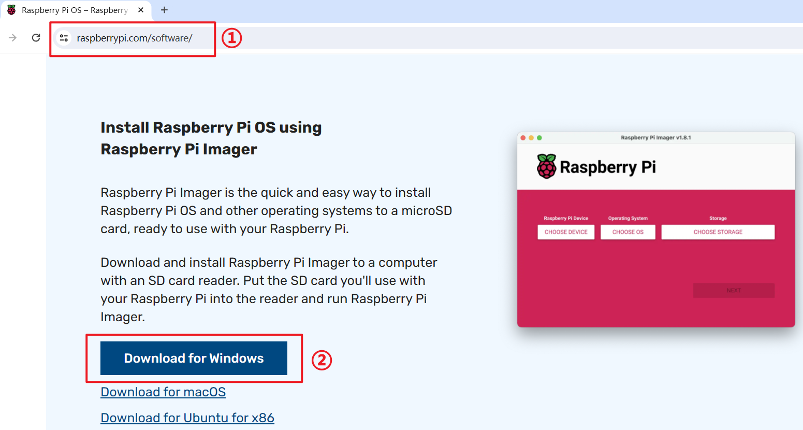
    <figcaption>download rpi imager tools</figcaption>
    </figure>

### 下载系统镜像
访问https://www.raspberrypi.com/software/operating-systems/，并且按照下图下载系统镜像。
    <figure markdown>
    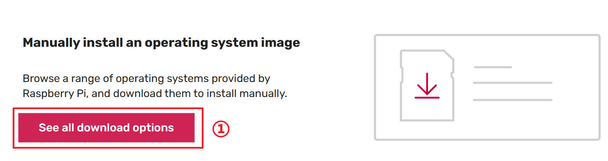
    <figcaption>open OS download link</figcaption>
    </figure>
    <figure markdown>
    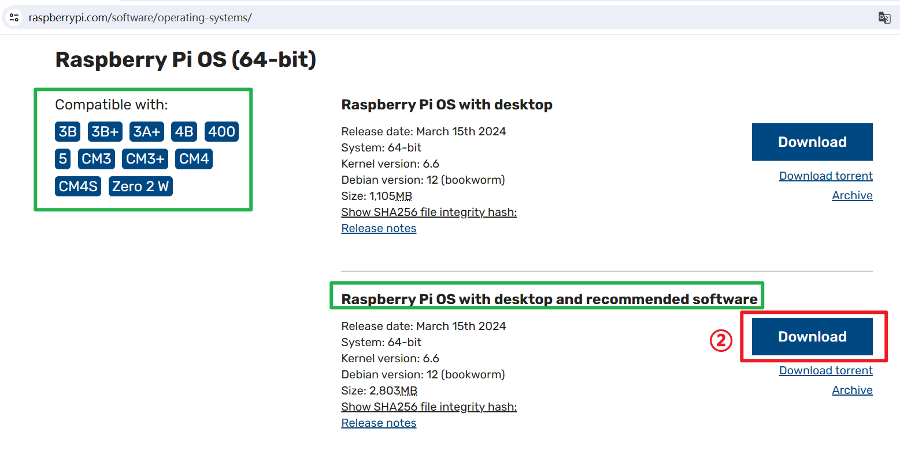
    <figcaption>choose 64bit os with recommended software</figcaption>
    </figure>

## 烧录系统
* 把全新的TF卡装到读卡器上，并插入到电脑的USB口。
    <figure markdown>
    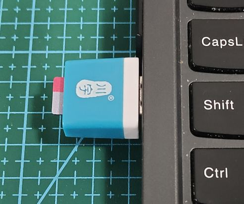
    <figcaption>insert new TF card to PC</figcaption>
    </figure>
* 双击imagerXXX.exe，进行烧录软件的默认安装
* 安装完毕后，打开Raspberry Pi Imager。系统询问是否要用管理员模式运行，选择`YES`
* 打开烧录软件界面后，有几个个地方需要选择：
  1. 选择设备为Pi5
    <figure markdown>
    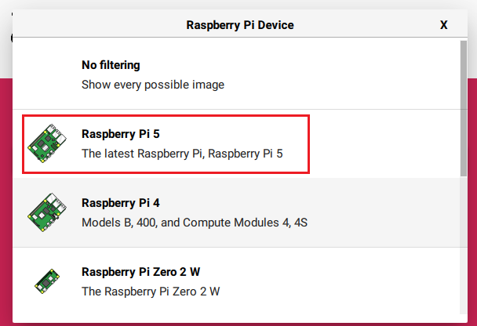
    <figcaption>choose device Pi5</figcaption>
    </figure>
  2. 选择操作操作系统镜像的位置
    <figure markdown>
    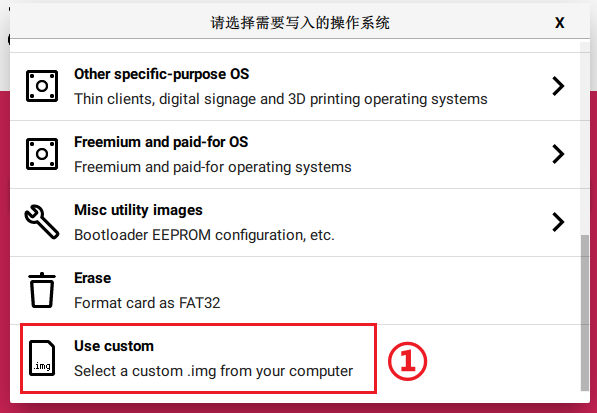
    <figcaption>use customer image file</figcaption>
    </figure>
    <figure markdown>
    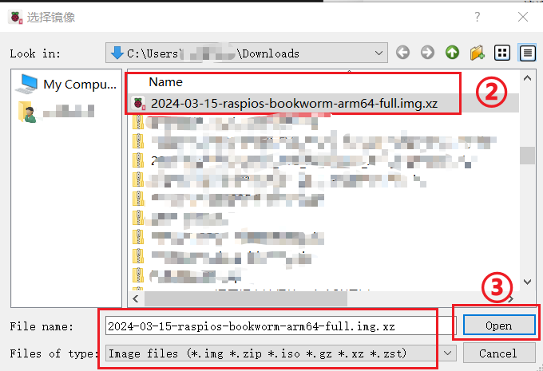
    <figcaption>select OS image file</figcaption>
    </figure>
  3. 选择TF设备的分区
    <figure markdown>
    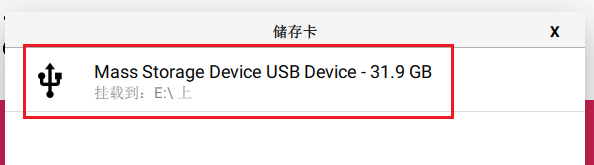
    <figcaption>select TF device</figcaption>
    </figure>

* 点击烧录按钮后，按照如下选择：
  1. 询问是否预先配置操作系统的设置，我们这里选择NO，让操作系统进行全新的按照，后面在进入系统之后，在详细的对系统进行配置
    <figure markdown>
    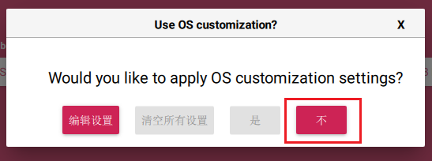
    <figcaption>edit OS config， choose 'NO' ,install default OS</figcaption>
    </figure>
  2. TF卡内数据将全部擦除，是否确认？
    <figure markdown>
    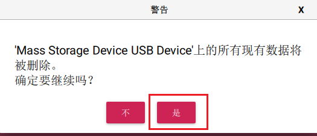
    <figcaption>erase all data, choose 'YES'</figcaption>
    </figure>

* 等待烧录完成，并且移除TF卡：
  由于不同系统镜像的大小不同，此外PC机器的读写速度不同，按照经验烧录并校验一个系统大约需要消耗30分钟.
    <figure markdown>
    
    <figcaption>erase all data, choose 'YES'</figcaption>
    </figure>
    <figure markdown>
    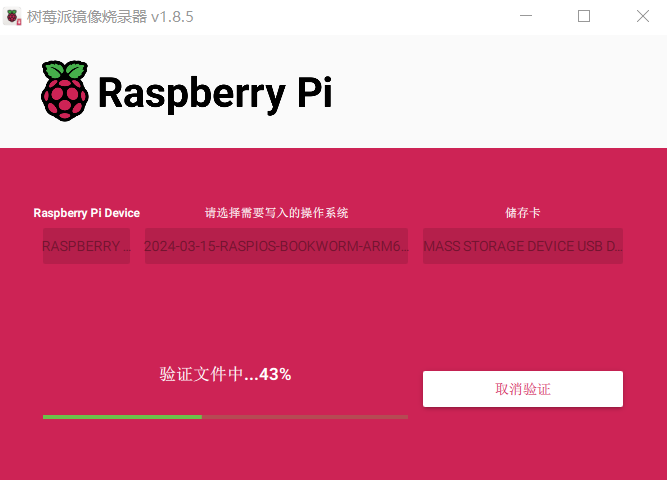
    <figcaption>verify the OS image</figcaption>
    </figure>
    <figure markdown>
    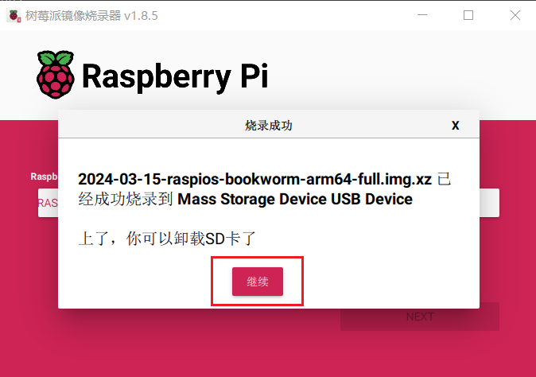
    <figcaption>burn OS image successful</figcaption>
    </figure>

    !!! warning "Notice"
        烧写完毕后，由于windows系统无法识别Liunx分区，询问是否要格式化TF卡，一定要选择'NO',否则刚才烧录好的系统卡将被擦除.

    <figure markdown>
    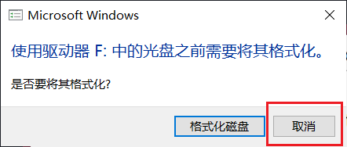
    <figcaption>cancel format TF</figcaption>
    </figure>

    <figure markdown>
    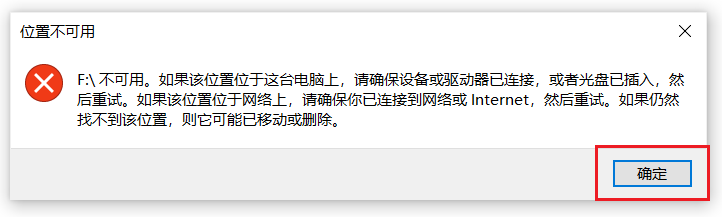
    <figcaption>ignore this error</figcaption>
    </figure>
