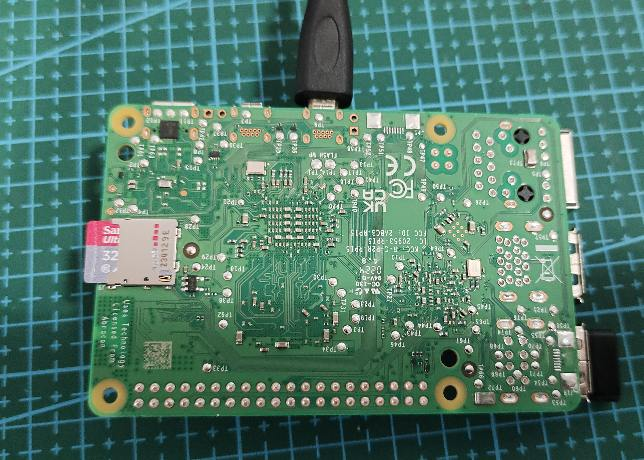
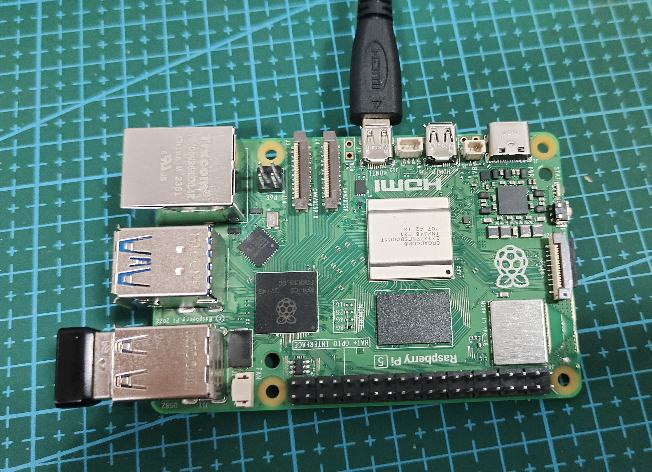

# 树莓派系统的首次设置

## 硬件准备
当系统刷入到tf卡后，在树莓派上应该接入如下设备，已方便对系统的初次设置：

 * TF卡插入树莓派5代主板背后
 * 在把micro HDMI视频线接入树莓派5代主板和显示器
 * 插入鼠标和键盘USB接收器（用有线鼠标和键盘也可以）
 * 把5V专用电源接入树莓派5代主板的TYPE-C电源口

    <figure markdown>
    
    <figcaption>insert TF</figcaption>
    </figure>

    <figure markdown>
    
    <figcaption>connect micro HDMI and keyboard/mouse receiver</figcaption>
    </figure>

## 视频教程

<figure markdown>
<iframe width="640" height="390" src="//player.bilibili.com/player.html?aid=1804582021&bvid=BV1Tb42187Kh&cid=1543647260&p=1" scrolling="no" border="0" frameborder="no" framespacing="0" allowfullscreen="true"> </iframe>
</figure>

!!! info "视频有画面，没有声音"
        请点击视频画面的右下角，把静音按钮关闭即可。
